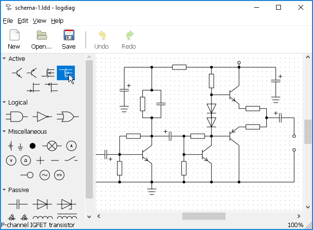

logdiag
=======

'logdiag' is a simple multiplatform schematic editor written in GTK+.

This software has never really been finished, and is no longer being worked on.

Packages
--------
Regular releases are sporadic.  git master should be stable enough.  You can get
a package with the latest development version from Archlinux's AUR.

Requirements
------------
Runtime dependencies: GTK+ >= 3.8, json-glib >= 0.10.4, lua >= 5.2 +
Build dependencies: CMake >= 2.8.12

Build from source on Unix-like systems
--------------------------------------
First check that you have all the required dependencies installed, including
development packages, if your distribution provides them.

Reserve a directory for an out-of-source build:

 $ mkdir build
 $ cd build

Let CMake prepare the build. You may change the directory where you want the
application to be installed. The default is _/usr/local_.

 $ cmake .. -DCMAKE_BUILD_TYPE=Release -DCMAKE_INSTALL_PREFIX=/usr

Now you have two basic choices of installing the application.

Using _make install_
~~~~~~~~~~~~~~~~~~~~

 # make install

Using _cpack_
~~~~~~~~~~~~~
You have to choose a package format understood by your system package manager.
CMake offers DEB and RPM.

After _cpack_ finishes making the package, install this file.

 $ cpack -G DEB
 # dpkg -i logdiag-version-system-arch.deb

Build from source on Windows
----------------------------
_Note that with the current method we're stuck with GTK+ 3.8.2._

First install CMake >= 3.1 and MinGW. Add both to your system path. If you want
to build an installation package, also install NSIS.

Run the following command in the directory with source files to automatically
fetch and setup all dependencies (contact me if the script becomes obsolete,
it's easy to fix but I usually update it only just a short while before
releasing a new version in order to resolve compatibility issues):

 > cmake -P Win32Depends.cmake

Reserve a directory for an out-of-source build:

 > mkdir build
 > cd build

Let CMake prepare the build:

 > cmake .. -G "MinGW Makefiles" -DCMAKE_BUILD_TYPE=Release

Now you can generate a package with CPack. You may choose between:

1. An NSIS-based installation package:
+
 > cpack -G NSIS

2. A portable ZIP package:
+
 > cpack -G ZIP

By default, that is if you specify no generator, both packages are built.

Cross-compilation for Windows
-----------------------------
The procedure is almost exactly the same as before, including the requirements.
Just install MinGW-w64 and let automation take care of the rest.

 $ cmake -P Win32Depends.cmake
 $ mkdir build
 $ cd build
 $ cmake .. \
   -DCMAKE_TOOLCHAIN_FILE=../ToolchainCrossMinGWW64.cmake \
   -DCMAKE_BUILD_TYPE=Release
 $ cpack

Alternatively, for an unnecessarily bloated MSYS2-based 64-bit build:

 $ sh Win64Depends.sh
 $ cmake -DCMAKE_TOOLCHAIN_FILE=ToolchainCrossWin64.cmake \
   -DCMAKE_BUILD_TYPE=Release -B build
 $ cmake --build build -- package

Contributing and Support
------------------------
Use https://git.janouch.name/p/logdiag to report any bugs, request features,
or submit pull requests.  `git send-email` is tolerated.  If you want to discuss
the project, feel free to join me at ircs://irc.janouch.name, channel #dev.

Bitcoin donations are accepted at: 12r5uEWEgcHC46xd64tt3hHt9EUvYYDHe9

License
-------
This software is released under the terms of the 0BSD license, the text of which
is included within the package along with the list of authors.
